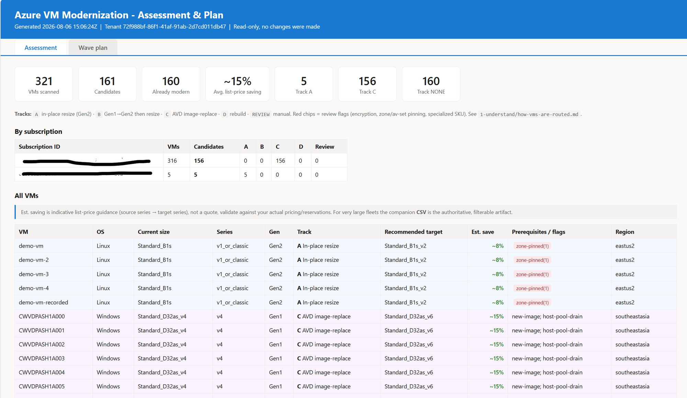
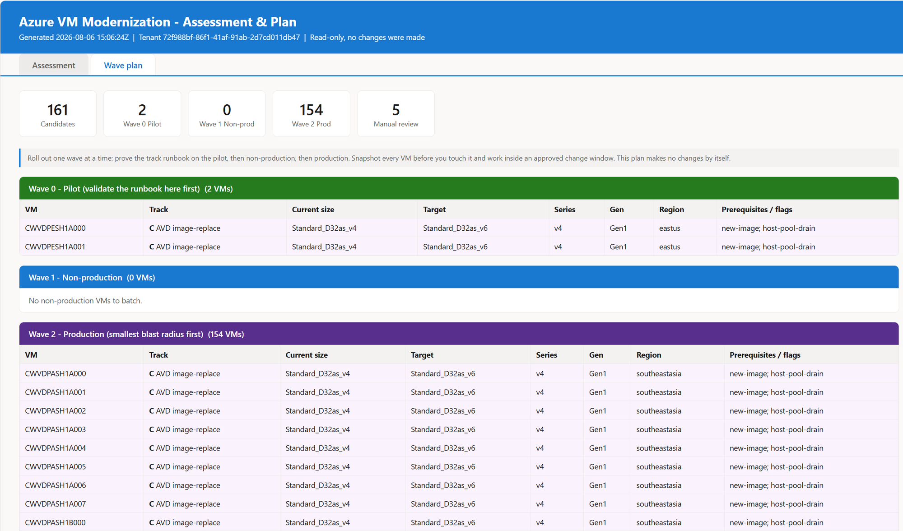
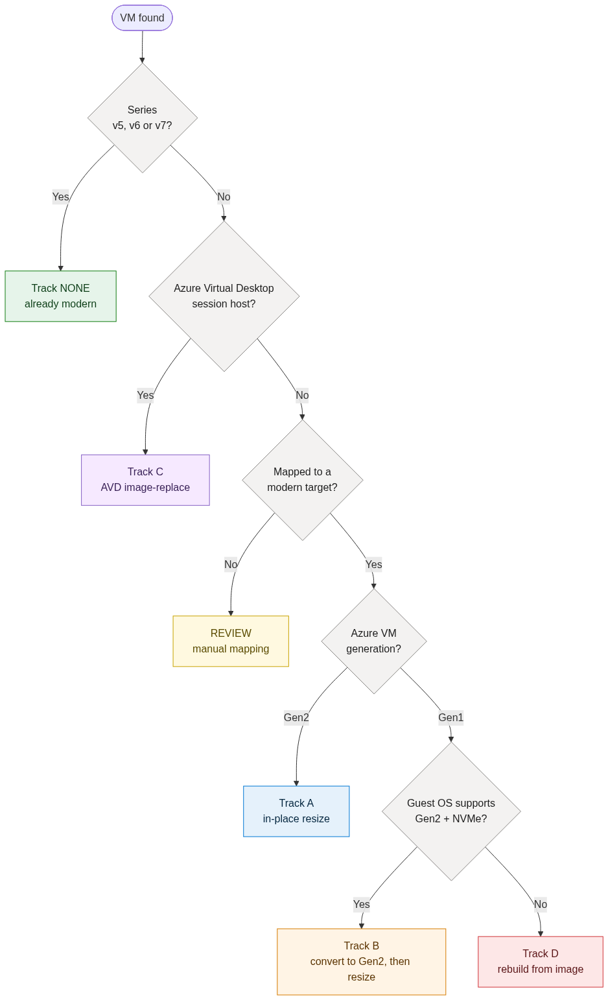
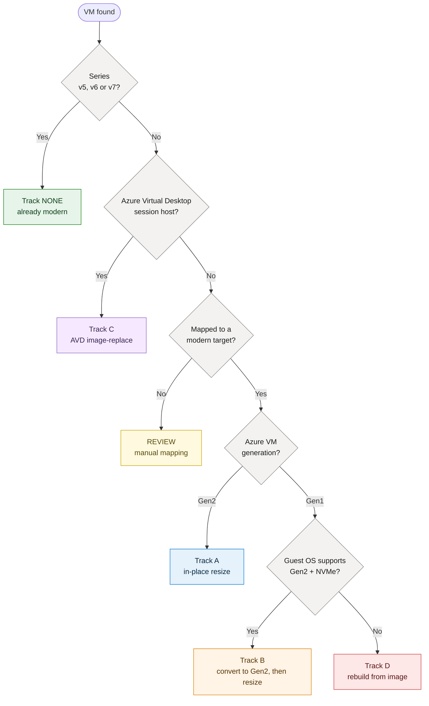

# Azure VM Modernization Toolkit

Assess your Azure Virtual Machines and get a **safe, guided plan** to modernize them
from older series (v1-v4) and **Gen1** to modern **Gen2** series (**v5 / v6 / v7**).

> **Read-only and safe to run.** The assessment only *reads* your environment, it
> **cannot change, stop, or delete anything**. Nothing leaves your Azure tenant.

---

## The journey (you are here)

Modernizing VMs is four questions, in order. This repo is organized the same way, so a
folder listing reads top-to-bottom like the path you actually take:

| Stage | The question it answers | Changes anything? |
|---|---|---|
| **[1 - Understand](1-understand/)** | *Why modernize, and what do these terms mean?* | No, reading |
| **[2 - Assess](2-assess/)** | *What do I have, and where should each VM go?* | No, read-only scan |
| **[3 - Plan](3-plan/)** | *In what order do I roll this out safely?* | No, planning |
| **[4 - Execute](4-execute/)** | *How do I make the change, per VM, safely?* | **Yes**, you, deliberately |

Stuck? **[help/](help/)** has the FAQ and troubleshooting.

**In a hurry?** Jump to [the fastest path](#fastest-path-azure-cloud-shell-recommended). New
to any of this? Start with [1 - Understand](1-understand/why-modernize.md).

---

## What this toolkit does

1. **Scans every subscription you can read** (in one pass, using Azure Resource Graph).
2. **Applies a decision tree** to each VM to determine the right modernization **track**.
3. **Produces a report** (HTML + CSV) with, for every VM: current size, generation,
   the recommended target size, what has to happen first, and an estimated monthly
   **cost saving**.
4. **Builds a wave plan** so you can modernize in safe batches (pilot -> non-prod -> prod).

It does **not** make changes. Execution runbooks are provided as **step-by-step guides**
([4-execute/](4-execute/)) that you follow deliberately, during a change window, with approvals.

---

## What the report looks like

One run produces a single HTML page with two tabs, backed by CSVs. These are from a real
scan of a 321-VM estate.

**Assessment tab** — every VM with its current size, generation, assigned track, recommended
target, estimated saving, prerequisites/flags, and a per-subscription rollup:



**Wave plan tab** — the same candidates grouped into safe rollout waves (pilot, non-prod,
production, manual review):



---

## How each VM is routed

Every VM is sent down **one** track. Full detail:
**[1-understand/how-vms-are-routed.md](1-understand/how-vms-are-routed.md)**.



<details>
<summary>Diagram source (Mermaid)</summary>



> Regenerate the image after editing: re-render this block and overwrite `samples/images/decision-tree.png`.
</details>

🟢 **NONE** already modern &nbsp;·&nbsp; 🔵 **A** resize &nbsp;·&nbsp; 🟠 **B** Gen1->Gen2 &nbsp;·&nbsp; 🟣 **C** AVD image-replace &nbsp;·&nbsp; 🔴 **D** rebuild &nbsp;·&nbsp; 🟡 **REVIEW** manual

---

## Fastest path (Azure Cloud Shell, recommended)

No installation. Works in any browser. You're already signed in.

1. Open **[https://shell.azure.com](https://shell.azure.com)** and choose **PowerShell**.
2. Paste this line and press **Enter**:

   ```powershell
   iwr https://raw.githubusercontent.com/babson44/azure-vm-modernization-toolkit/main/bootstrap.ps1 | iex
   ```

   This runs the **assessment and the wave plan in one shot** and writes a single
   report with two tabs (**Assessment** + **Wave plan**).

3. **Your report opens itself.** When it finishes, the HTML report is **automatically
   sent to your browser's downloads**, just open the downloaded file. Want it rendered
   *without* downloading? Add `-Serve` (see below) and click the **Web preview** button
   in the Cloud Shell toolbar.

That's it. New to Cloud Shell? The zero-assumptions walkthrough is in **Stage 2**:
**[2-assess/README.md](2-assess/README.md)**.

Everything here is **read-only**. It never changes, stops, or deletes anything.

---

## Prefer to clone first? (enterprise / security-reviewed path)

Some organizations block `iwr ... | iex` by policy, or you may simply want to **read the
code before you run it**. That's fully supported. Clone the repo, review the scripts,
then run the same one-shot assessment:

```powershell
git clone https://github.com/babson44/azure-vm-modernization-toolkit
cd azure-vm-modernization-toolkit
./scripts/run.ps1
```

This does exactly what the one-liner does (read-only **assess + wave plan** in one pass,
across every subscription you can read), but nothing runs until **you** have inspected
the code. Add `-Serve` to open the report from the Cloud Shell **Web preview** button.

---

## The two steps, explained

The one-liner above does both of these for you. If you'd rather run them yourself, or
you want a person to review the assessment **before** a plan is produced, run them
separately. Both are read-only.

First get the toolkit (once):

```powershell
git clone https://github.com/babson44/azure-vm-modernization-toolkit ~/azure-vm-modernization-toolkit
cd ~/azure-vm-modernization-toolkit
```

### Step 1 - Assess (what do I have, and where should each VM go?)

Scans **every subscription you can read** in one pass, routes each VM through the
decision tree, and tells you, per VM: current size and generation, the recommended
**target** size, what has to happen first, and an estimated monthly **saving**. It
produces an **assessment report** (HTML + CSV).

```powershell
./scripts/assess.ps1
```

The assessment answers **"what and where."** Review it, then move on. Full detail:
**[2-assess/README.md](2-assess/README.md)**.

### Step 2 - Plan (in what order do I roll this out safely?)

Takes the assessment and groups the candidates into **rollout waves** so you never
change the whole fleet at once:

- **Wave 0 - Pilot:** a couple of low-risk VMs per track. Prove the runbook here first.
- **Wave 1 - Non-production**
- **Wave 2 - Production**, smallest blast radius first.
- **Manual review:** VMs with encryption, zone/availability-set pinning, or specialized
  SKUs that a human must map before batching.

The plan answers **"in what order, and in what batches."** That sequencing is the value
it adds on top of the assessment. Pass the assessment CSV that Step 1 wrote:

```powershell
./scripts/plan.ps1 -AssessmentCsv ./reports/assessment-<timestamp>.csv
```

> `<timestamp>` is a **placeholder**. Use the real file name Step 1 printed, for example
> `assessment-20260731-174256.csv`. Tip: `ls ./reports` shows it, or let tab-completion
> fill it in.

The plan writes the same two-tab HTML (**Assessment** + **Wave plan**) plus a plan CSV.
Full detail: **[3-plan/README.md](3-plan/README.md)**.

### Prefer one command?

`run.ps1` is exactly Step 1 + Step 2 back to back, with one combined report:

```powershell
./scripts/run.ps1
```

### Viewing the report without downloading

Any of the three scripts accepts `-Serve` to host the finished report locally so you can
open it, fully rendered, from the Cloud Shell **Web preview** button:

```powershell
./scripts/run.ps1 -Serve          # or assess.ps1 -Serve / plan.ps1 ... -Serve
```

---

## Prefer your own machine?

You can run exactly the same thing from local **PowerShell 7+** with the **Azure CLI**.
The sign-in and scope steps are in **[2-assess/README.md](2-assess/README.md)**.

---

## Where everything lives

| Folder | What's in it |
|---|---|
| **[1-understand/](1-understand/)** | Why modernize, Gen1 vs Gen2, key concepts (Trusted Launch, NVMe, UEFI), and how each VM is routed |
| **[2-assess/](2-assess/)** | Open Cloud Shell, sign in, scope multiple subscriptions, run the scan, read every column of the report |
| **[3-plan/](3-plan/)** | Turn the assessment into rollout waves, and the two human approval gates |
| **[4-execute/](4-execute/)** | The track runbooks (A/B/C/D), the safe per-VM sequence, snapshots and rollback |
| **[help/](help/)** | FAQ and troubleshooting |
| `scripts/` | The PowerShell (`assess.ps1`, `plan.ps1`, `run.ps1`, shared lib) |
| `config/` | `sku-map.json`, old family -> recommended target + prerequisites |
| `samples/` | An example report so you can see the output before you run it |

**Track runbooks** (the actual how-to for making changes):
[Track A - Resize](4-execute/track-a-resize.md) ·
[Track B - Gen1->Gen2](4-execute/track-b-gen1-to-gen2.md) ·
[Track C - AVD image-replace](4-execute/track-c-avd-image-replace.md) ·
[Track D - Rebuild](4-execute/track-d-rebuild.md)

---

## Large environments & many subscriptions

Built for tenants with **hundreds of subscriptions and tens of thousands of VMs**:

- **One pass, all subscriptions.** Uses **Azure Resource Graph**, which queries every
  subscription your identity can read in a single call, there is no per-subscription loop
  to babysit. Grant **Reader at the management-group root** and the scan covers everything
  beneath it automatically.
- **Paged + throttle-aware.** Results are fetched page-by-page (1,000 rows at a time) and
  each page **retries with exponential backoff** if Resource Graph throttles (HTTP 429).
  If a page can't be recovered, the scan **stops and tells you** rather than silently
  returning a partial fleet.
- **The CSV is the authoritative artifact.** The HTML report is great for a few thousand
  rows; for very large fleets, work from the **CSV** (open in Excel / Power BI, filter,
  pivot). The HTML always includes a **per-subscription rollup** so a big tenant is
  digestible at a glance.
- **Multiple tenants?** Resource Graph is scoped to the signed-in tenant. For each
  additional tenant, run `az login --tenant <id>` and re-run the assessment. See
  **[2-assess/README.md](2-assess/README.md)**.

---

## What you need

- An Azure account with **Reader** on the subscriptions you want to assess.
  (Reader is enough, the assessment never writes.)
- **Azure Cloud Shell** (nothing to install) *or* local **PowerShell 7+** with **Azure CLI**.

---

## Safety & scope

- The assessment is **100% read-only**. Required role: **Reader**.
- Making changes (resize, convert, rebuild) is done by **you**, following the track
  runbooks, with **snapshots first** and a **rollback** path documented.
- See **[DISCLAIMER.md](DISCLAIMER.md)**. Licensed under **[MIT](LICENSE)**.

---

## Roadmap

- **Phase 1 (this release):** assess + plan + guided track runbooks. *Read-only.*
- **Phase 2 (planned):** optional gated execution scripts (dry-run default, snapshot +
  rollback) for customers who want automation once the decision tree is proven.
