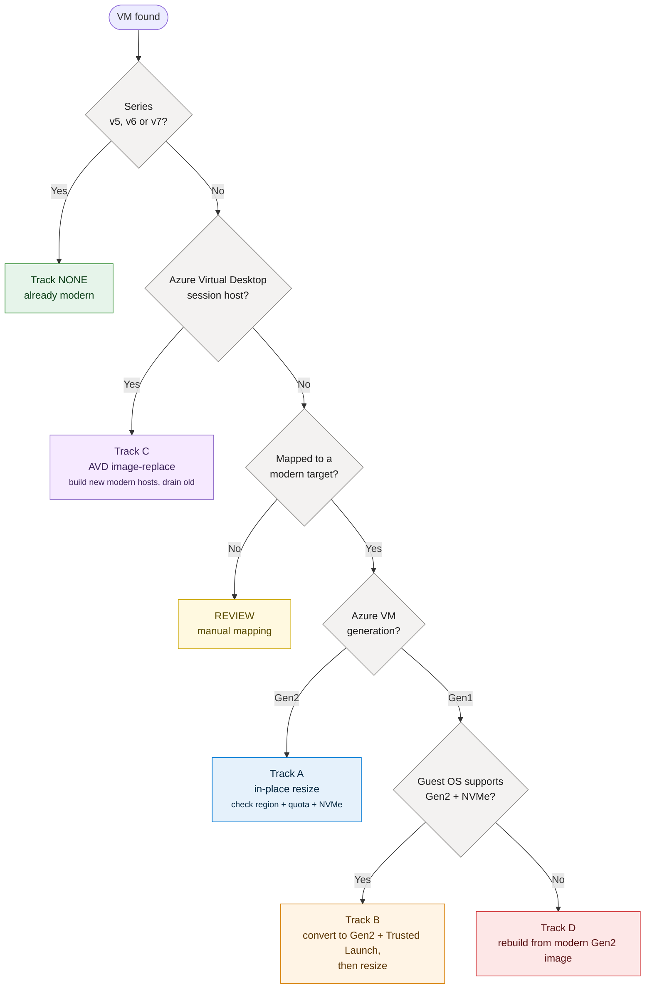

# 04 – Decision tree & tracks

Every VM the assessment finds is routed through this tree to exactly one **track**. The
script implements it in `scripts/lib/common.ps1` (`Get-Verdict`); this page is the
human‑readable version.

## The tree

**Legend** &nbsp;
🟢 NONE (modern) &nbsp; 🔵 A resize &nbsp; 🟠 B Gen1→Gen2 &nbsp; 🟣 C AVD &nbsp; 🔴 D rebuild &nbsp; 🟡 REVIEW

> The "Guest OS supports Gen2 + NVMe?" decision can't be read reliably from the API, so the
> assessment routes Gen1 VMs to **Track B by default** and marks it clearly: *if the OS
> can't support Gen2/NVMe, switch that VM to Track D.* You confirm OS support in the Track B
> runbook before doing anything.

## Review flags (pulled aside regardless of track)

Some conditions mean a VM should get **human eyes before it's batched**, even if it has a
clean track. The assessment tags these; the planner drops them into a **Manual review**
bucket:

| Flag | Why it matters |
|---|---|
| `encrypted-disk` | Azure Disk Encryption / customer‑managed keys need care during resize/convert; validate key access and re‑attach behaviour. |
| `availability-set-pinned` | Resizing within an availability set can fail if the target size isn't supported by that set; may need a new set or a fault‑domain plan. |
| `zone-pinned` | The target size must exist **in that specific zone**; availability differs per zone. |
| `specialized-sku` | GPU (N‑series), HPC (H‑series), memory (M‑series) or confidential (DC/EC) VMs have their own upgrade paths and constraints — not a generic resize. |

## The four tracks (summary)

| Track | Trigger | Downtime | Runbook |
|---|---|---|---|
| **A – Resize** | Gen2, older series | Minutes (reboot) | [track-a-resize.md](tracks/track-a-resize.md) |
| **B – Gen1→Gen2** | Gen1, OS supports Gen2/NVMe | Short (convert + reboot) | [track-b-gen1-to-gen2.md](tracks/track-b-gen1-to-gen2.md) |
| **C – AVD image‑replace** | AVD host pool | Near‑zero (drain) | [track-c-avd-image-replace.md](tracks/track-c-avd-image-replace.md) |
| **D – Rebuild** | Gen1, OS too old | Planned (redeploy) | [track-d-rebuild.md](tracks/track-d-rebuild.md) |

## Why AVD is its own track

An AVD host pool is a **fleet of interchangeable session hosts** built from a shared image.
The safe, standard way to modernize it is **not** to resize each host in place, but to build
**new Gen2 / modern‑series hosts** from an updated image, add them to the pool, and **drain**
users off the old ones. That gives near‑zero user impact and a clean rollback (keep the old
hosts until you're confident). The assessment detects likely AVD hosts by resource‑group /
name / tag patterns and routes them to Track C.
