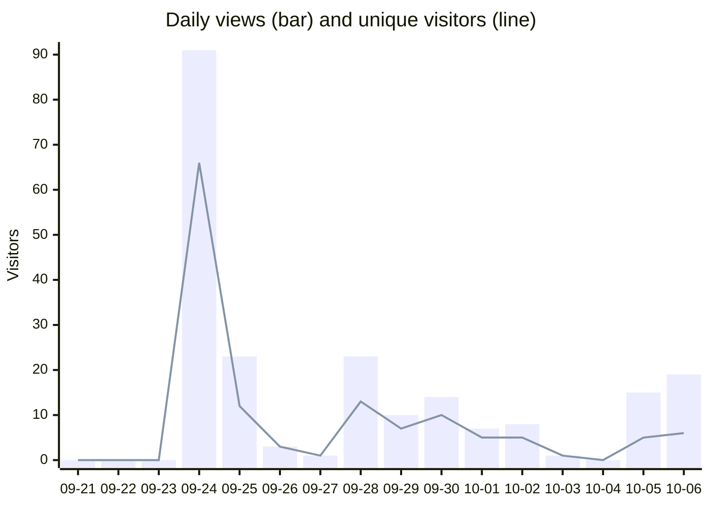
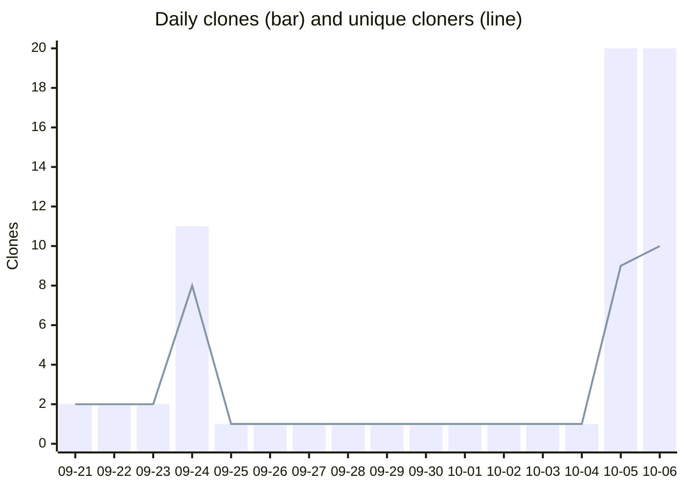

# Toolkit Usage Dashboard

_Auto-generated 2026-10-07 by the Traffic snapshot workflow. History: 2026-09-21 to 2026-10-06._

> **How to read this:** _Clones_ are downloads that run the toolkit (each is a git checkout). _Views_ are page visits. GitHub Traffic is anonymous, so these are counts only, never usernames. A few clones each day come from this repo's own automation, not people.

## At a glance

| Metric | Views | Clones |
|---|---:|---:|
| Total (all history) | 215 | 67 |
| Last 7 days | 64 | 45 |
| Daily average | 13.4 | 4.2 |
| Busiest day | 2026-09-24 (91) | 2026-10-05 (20) |

## Daily views

## Daily clones

## Recent activity (last 14 days)

| Date | Views | Unique visitors | Clones | Unique cloners |
|---|---:|---:|---:|---:|
| 2026-09-23 | 0 | 0 | 2 | 2 |
| 2026-09-24 | 91 | 66 | 11 | 8 |
| 2026-09-25 | 23 | 12 | 1 | 1 |
| 2026-09-26 | 3 | 3 | 1 | 1 |
| 2026-09-27 | 1 | 1 | 1 | 1 |
| 2026-09-28 | 23 | 13 | 1 | 1 |
| 2026-09-29 | 10 | 7 | 1 | 1 |
| 2026-09-30 | 14 | 10 | 1 | 1 |
| 2026-10-01 | 7 | 5 | 1 | 1 |
| 2026-10-02 | 8 | 5 | 1 | 1 |
| 2026-10-03 | 1 | 1 | 1 | 1 |
| 2026-10-04 | 0 | 0 | 1 | 1 |
| 2026-10-05 | 15 | 5 | 20 | 9 |
| 2026-10-06 | 19 | 6 | 20 | 10 |

---
_Source: GitHub repository Traffic API. Raw history lives in `metrics/traffic-views.csv` and `metrics/traffic-clones.csv`._
