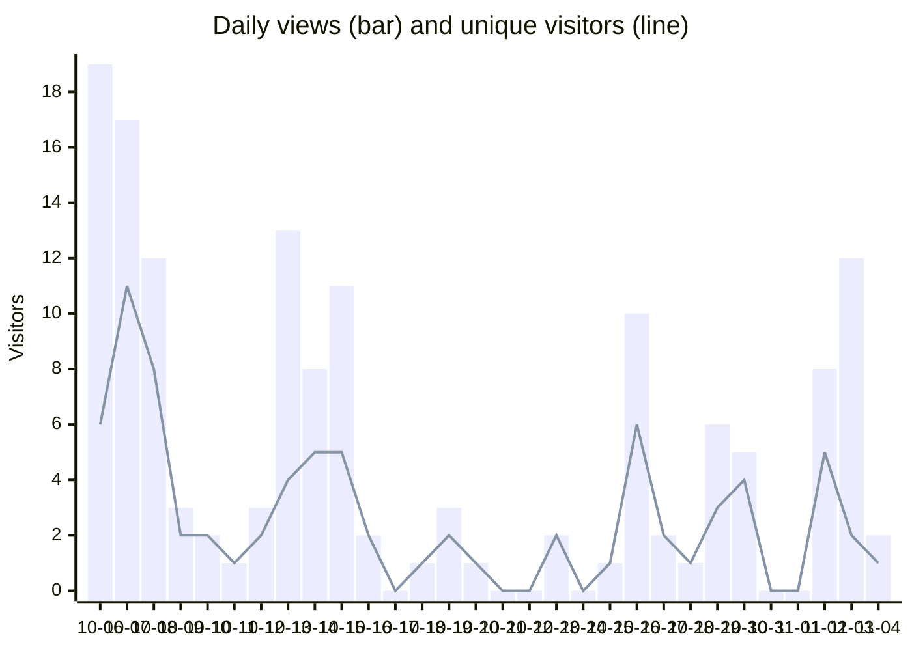
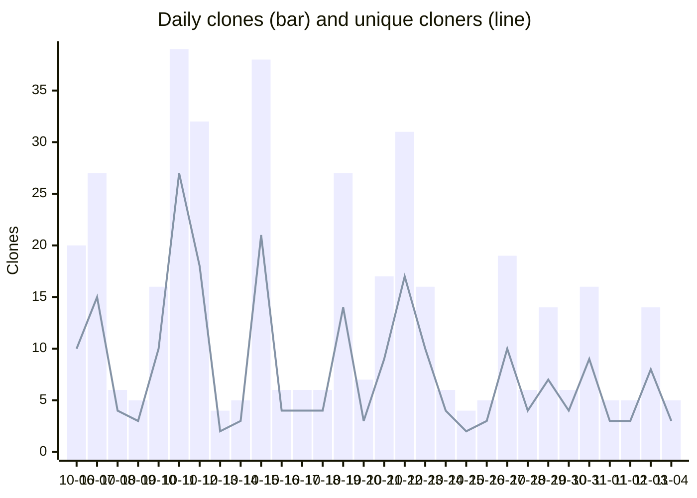

# Toolkit Usage Dashboard

_Auto-generated 2026-11-05 by the Traffic snapshot workflow. History: 2026-09-21 to 2026-11-04._

> **How to read this:** _Clones_ are downloads that run the toolkit (each is a git checkout). _Views_ are page visits. GitHub Traffic is anonymous, so these are counts only, never usernames. A few clones each day come from this repo's own automation, not people.

## At a glance

| Metric | Views | Clones |
|---|---:|---:|
| Total (all history) | 341 | 460 |
| Last 7 days | 33 | 65 |
| Daily average | 7.6 | 10.2 |
| Busiest day | 2026-09-24 (91) | 2026-10-11 (39) |

## Daily views

```mermaid
xychart-beta
    title "Daily views (bar) and unique visitors (line)"
    x-axis [10-06, 10-07, 10-08, 10-09, 10-10, 10-11, 10-12, 10-13, 10-14, 10-15, 10-16, 10-17, 10-18, 10-19, 10-20, 10-21, 10-22, 10-23, 10-24, 10-25, 10-26, 10-27, 10-28, 10-29, 10-30, 10-31, 11-01, 11-02, 11-03, 11-04]
    y-axis "Visitors" 0 --> 19
    bar [19, 17, 12, 3, 2, 1, 3, 13, 8, 11, 2, 0, 1, 3, 1, 0, 0, 2, 0, 1, 10, 2, 1, 6, 5, 0, 0, 8, 12, 2]
    line [6, 11, 8, 2, 2, 1, 2, 4, 5, 5, 2, 0, 1, 2, 1, 0, 0, 2, 0, 1, 6, 2, 1, 3, 4, 0, 0, 5, 2, 1]
```

## Daily clones

```mermaid
xychart-beta
    title "Daily clones (bar) and unique cloners (line)"
    x-axis [10-06, 10-07, 10-08, 10-09, 10-10, 10-11, 10-12, 10-13, 10-14, 10-15, 10-16, 10-17, 10-18, 10-19, 10-20, 10-21, 10-22, 10-23, 10-24, 10-25, 10-26, 10-27, 10-28, 10-29, 10-30, 10-31, 11-01, 11-02, 11-03, 11-04]
    y-axis "Clones" 0 --> 39
    bar [20, 27, 6, 5, 16, 39, 32, 4, 5, 38, 6, 6, 6, 27, 7, 17, 31, 16, 6, 4, 5, 19, 6, 14, 6, 16, 5, 5, 14, 5]
    line [10, 15, 4, 3, 10, 27, 18, 2, 3, 21, 4, 4, 4, 14, 3, 9, 17, 10, 4, 2, 3, 10, 4, 7, 4, 9, 3, 3, 8, 3]
```

## Recent activity (last 14 days)

| Date | Views | Unique visitors | Clones | Unique cloners |
|---|---:|---:|---:|---:|
| 2026-10-22 | 0 | 0 | 31 | 17 |
| 2026-10-23 | 2 | 2 | 16 | 10 |
| 2026-10-24 | 0 | 0 | 6 | 4 |
| 2026-10-25 | 1 | 1 | 4 | 2 |
| 2026-10-26 | 10 | 6 | 5 | 3 |
| 2026-10-27 | 2 | 2 | 19 | 10 |
| 2026-10-28 | 1 | 1 | 6 | 4 |
| 2026-10-29 | 6 | 3 | 14 | 7 |
| 2026-10-30 | 5 | 4 | 6 | 4 |
| 2026-10-31 | 0 | 0 | 16 | 9 |
| 2026-11-01 | 0 | 0 | 5 | 3 |
| 2026-11-02 | 8 | 5 | 5 | 3 |
| 2026-11-03 | 12 | 2 | 14 | 8 |
| 2026-11-04 | 2 | 1 | 5 | 3 |

---
_Source: GitHub repository Traffic API. Raw history lives in `metrics/traffic-views.csv` and `metrics/traffic-clones.csv`._
